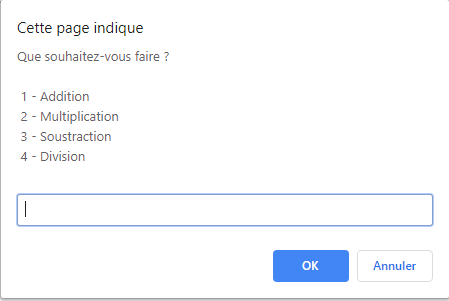

# Realisation d'une calculatrice en JS

 Dans cette première étape, je vais vous demander d'afficher un menu à notre utilisateur, comportant les 4 modes que nous lui proposons :

- Addition
- Multiplication
- Soustraction
- Division

Nous utiliserons ce menu pour récupérer un nombre : 1, 2, 3 ou 4, qui nous permettra de savoir ce que l'utilisateur souhaite faire. Nous stockerons ce choix dans une variable `choix`.

Résultat recherché :

